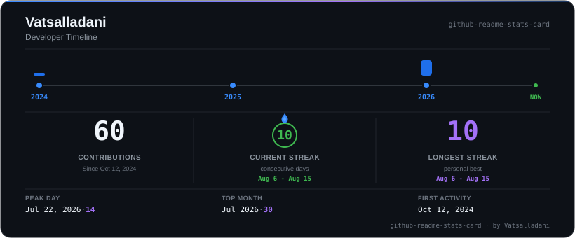

# 📊 GitHub Stats Card

A GitHub README-compatible developer timeline card generated from real GitHub contribution data. The card summarises lifetime contribution history, streaks, peak activity, and a year-by-year timeline — all derived from the GitHub GraphQL API, committed as static assets, and served directly from this repository.

<p align="left">
  <a href="https://github.com/Vatsalladani/github-readme-stats-card"></a>
  <a href="https://github.com/Vatsalladani/github-readme-stats-card/actions"></a>
  <a href="https://docs.github.com/en/graphql"></a>
  <a href="https://vercel.com"></a>
  <a href="./LICENSE"></a>
</p>

---

### 🖼️ Card Preview

<p align="center">
  
</p>

> 💡 **Animated version:** [`github-stats.gif`](./assets/github-stats.gif)

---

## 📑 Table of Contents

- [✨ Features](#-features)
- [📊 What the Card Shows](#-what-the-card-shows)
- [🕒 Lifetime History](#-lifetime-history)
- [⚙️ How It Works](#%EF%B8%8F-how-it-works)
- [🔄 Automatic Updates](#-automatic-updates)
- [🌐 Public API](#-public-api)
- [🚀 Getting Started](#-getting-started)
- [📥 Usage](#-usage)
- [🛠️ Self-Hosting](#%EF%B8%8F-self-hosting)
- [📁 Project Structure](#-project-structure)
- [⚠️ Data & Limitations](#%EF%B8%8F-data--limitations)
- [🔐 Security](#-security)
- [👨‍💻 Creator](#-creator)
- [📜 License](#-license)

---

## ✨ Features

- **Lifetime contribution history** — timeline begins at the earliest recorded contribution, not a fixed date
- **Year-by-year developer timeline** with proportional activity bars
- **Current streak** — consecutive contribution days up to the latest available date
- **Longest streak** — personal best from all available history
- **Peak contribution day** — single highest-activity date
- **Top contribution month** — most active calendar month in recorded history
- **First and last activity dates**
- **Static SVG card** — no JavaScript, no external runtime, renders in any GitHub README
- **Optional animated GIF** — subtle professional reveal animation
- **Automatic weekly updates** via GitHub Actions
- **Data from GitHub GraphQL API** — no third-party service
- **Free to use** — runs entirely on GitHub infrastructure
- **Self-hostable** — fork and point at any GitHub username

---

## 📊 What the Card Shows

### `VATSALLADANI` — Developer Name

The GitHub username whose contribution history is being displayed. This is shown in the card header as the primary identity.

### `github-readme-stats-card` — Project Name

Shown in the top-right and bottom-right of the card. This is the name of the repository that generates the card, not the developer's username.

### Developer Timeline

```text
2024 ────●──────────────●──────────────●- - - - ● NOW
        2024           2025           2026
```

Each node represents a calendar year. The bar above each node reflects that year's total contribution count relative to the most active year. A zero-activity year shows a minimal stub to preserve timeline continuity. The dashed segment from the last year node to **NOW** indicates the current period is still in progress.

The timeline is built from whatever years GitHub's API reports as active. When a new year begins and GitHub registers contributions, it appears automatically on the next run — no source code change is needed.

### Contributions

The total number of GitHub contributions recorded across the full tracked history period. GitHub's contribution count includes commits to the default branch, pull requests, issues, and code reviews — as defined by GitHub's own contribution rules.

> [!NOTE]
> **Example:** `49` means GitHub recorded 49 contributions across the tracked history.

### Current Streak

The number of consecutive calendar days, ending on the most recent date for which GitHub has recorded data, on which at least one contribution was made. If today has no contributions yet (and the previous day does), the streak reflects the completed run ending yesterday.

> [!NOTE]
> **Example:** `7 days` means contributions occurred on seven consecutive days.

### Longest Streak

The longest run of consecutive contribution days found anywhere in the available history.

> [!NOTE]
> **Example:** `7 days` means the longest consecutive sequence in the tracked history is seven days.

### Peak Day

The single calendar day with the highest recorded contribution count.

> [!NOTE]
> **Example:** `Jul 22, 2026 · 14` means GitHub recorded 14 contributions on that day.

### Top Month

The calendar month with the highest total contribution count, aggregated from daily data.

> [!NOTE]
> **Example:** `Jul 2026 · 30` means 30 contributions were recorded across all days in July 2026.

### First Activity

The earliest date on which GitHub recorded a contribution in the available history. This is **not** the same as the account creation date. An account may exist for some time before any contributions are recorded.

> [!NOTE]
> **Example:** history starting `2024-10-13` with an account created `2024-10-12` means contributions began one day after account creation.

---

## 🕒 Lifetime History

The card does not use a fixed 12-month, 1-year, 3-year, or any other rolling window.

The generator fetches the list of contribution years directly from GitHub's API (`contributionYears` field), then retrieves daily contribution data for every year in that list, from the earliest year through the current date. GitHub limits contribution queries to a maximum one-year window per request, so the generator fetches data in yearly chunks and combines them.

**How future years are handled:**  
When GitHub registers the first contribution in a new year (e.g. 2027), that year appears in `contributionYears`. On the next generation run, the generator fetches the new chunk automatically, adds the year to the timeline, and updates all statistics accordingly. No source code change is required.

There is no artificial expiration date or hardcoded end year. The system depends on GitHub's API, GitHub Actions availability, and a valid repository token — conditions outside this project's control.

---

## ⚙️ How It Works

```text
GitHub GraphQL API
        │
        ├─ user.createdAt           → account_created
        └─ contributionYears        → list of active years
                │
                └─ contributionsCollection (one request per year)
                        │
                        └─ daily contributionCount for each day
                                │
                                ├─ Total contributions
                                ├─ Current streak
                                ├─ Longest streak
                                ├─ Peak day
                                ├─ Top month
                                ├─ Yearly activity map
                                ├─ history_start (first day with count > 0)
                                └─ history_end   (last day with count > 0)
                                        │
                                        ├─ assets/stats_data.json
                                        ├─ assets/github-stats.svg   ← primary
                                        └─ assets/github-stats.gif   ← optional
                                                │
                                        GitHub README (static asset)
```

**Why yearly chunks?**  
The GitHub GraphQL `contributionsCollection` field accepts a `from`/`to` date range, but enforces a maximum window of one year per query. The generator loops through each active contribution year and combines the results.

**Dependencies:**
- Python standard library (`urllib`, `json`, `datetime`, `collections`)
- [Pillow](https://python-pillow.org/) for animated GIF generation

---

## 🔄 Automatic Updates

The workflow at `.github/workflows/update-stats.yml` runs every Sunday at 00:00 UTC and supports manual dispatch from the Actions tab.

Each run:
1. Runs `scripts/generate_stats.py` — fetches current GitHub data, writes `stats_data.json` and `github-stats.svg`
2. Runs `scripts/generate_animation.py` — reads `stats_data.json`, writes `github-stats.gif`
3. Stages only the three generated asset files
4. Commits with the message `chore: update github stats [skip ci]` — only when files actually changed
5. `[skip ci]` in the commit message prevents the workflow from triggering itself again

**Token:** The workflow uses `GITHUB_TOKEN`, which GitHub Actions provides automatically for the repository. No additional secrets need to be configured for the default single-owner setup.

GitHub Actions availability and quotas are subject to GitHub's standard terms. The workflow does not guarantee indefinite free execution under all account conditions.

---

## 🌐 Public API

This repository is deployed as a serverless public API. Any developer can embed a dynamically-generated card for their own GitHub account without forking.

**Embed in your README:**

```markdown

```

or as an HTML img tag for width control:

```html

```

Replace `YOUR_USERNAME` with your exact GitHub login. The card will display that user's real GitHub contribution data.

> [!NOTE]
> **Deployment Notice:** The API is deployed at Vercel. Update the domain above once the deployment URL is confirmed.

**Caching:** Responses are cached at the CDN edge for up to 1 hour (`Cache-Control: public, s-maxage=3600, stale-while-revalidate=86400`). A cache miss may require several GitHub GraphQL calls depending on how many years of history the user has.

**Rate limits:** The API uses a server-side GitHub token. The token is never exposed to callers.

---

## 🚀 Getting Started

### Clone the Repository

```bash
git clone https://github.com/Vatsalladani/github-readme-stats-card.git
cd github-readme-stats-card
```

---

## 📥 Usage

The card in this repository is generated for **Vatsalladani's** GitHub account specifically. The generated SVG is committed to this repository and served as a static file via GitHub's raw content URL.

**Embed in a GitHub README:**

```html

```

**Embed the animated version:**

```html

```

> [!NOTE]
> These URLs serve **Vatsalladani's** pre-generated static assets. For a live card with your own data, use the [Public API](#-public-api) above or follow the Self-Hosting instructions below.

---

## 🛠️ Self-Hosting

To generate this card for your own GitHub account:

**1. Fork this repository.**

**2. Set your GitHub username.**

In `.github/workflows/update-stats.yml`, add a `GITHUB_USERNAME` environment variable to the generation steps:

```yaml
- name: Generate stats and SVG
  env:
    GITHUB_TOKEN: ${{ secrets.GITHUB_TOKEN }}
    GITHUB_USERNAME: your-github-username
  run: python scripts/generate_stats.py
```

`GITHUB_TOKEN` is provided automatically by GitHub Actions. No additional secret setup is required for public repositories.

**3. Run the workflow manually.**

Go to **Actions → Update GitHub Stats → Run workflow** in your forked repository. This generates your first card.

**4. Embed the card in your profile README.**

```html

```

Replace `YOUR-USERNAME` with your GitHub username.

**5. Optionally, adjust the update schedule.**

The default schedule is weekly (every Sunday). Edit the `cron` expression in `update-stats.yml` to change the frequency.

---

## 📁 Project Structure

```text
github-readme-stats-card/
│
├── scripts/
│   ├── generate_stats.py       # Fetches GitHub data via GraphQL, writes SVG + JSON
│   └── generate_animation.py   # Reads JSON, generates animated GIF
│
├── assets/
│   ├── fonts/
│   │   ├── JetBrainsMono-Regular.ttf
│   │   ├── JetBrainsMono-Bold.ttf
│   │   ├── JetBrainsMono-ExtraLight.ttf
│   │   └── OFL.txt             # Font license (SIL Open Font License 1.1)
│   ├── github-stats.svg        # Primary card — embed this in your README
│   ├── github-stats.gif        # Animated version (optional)
│   └── stats_data.json         # Intermediate data file used by the GIF generator
│
├── .github/
│   └── workflows/
│       └── update-stats.yml    # GitHub Actions: weekly auto-update workflow
│
├── README.md
└── LICENSE
```

---

## ⚠️ Data & Limitations

- **Contribution counts follow GitHub's definition:** GitHub counts commits to the default or gh-pages branch, pull requests, issues, and code reviews as contributions. Commits to non-default branches, forks (without merged PRs), or private repositories without visibility may or may not be counted depending on your account settings.
- **Account creation date ≠ history start:** `account_created` records when the GitHub account was created. `history_start` records the date of the first contribution GitHub's API returns data for. These can differ by days, months, or more.
- **Zero-activity years are included in the timeline:** If a year falls within the account's contribution history range but has no recorded contributions, it appears as a minimal node on the timeline. This preserves visual continuity.
- **Data may lag by hours:** GitHub does not always reflect contributions in the API immediately. The generated card reflects data available at the time of the last successful generation run.
- **Yearly chunks:** GitHub's GraphQL API enforces a one-year maximum window per `contributionsCollection` query. Fetching a three-year history requires three API requests. Network or API errors during any chunk will abort the run without updating assets.
- **GIF font rendering:** `generate_animation.py` uses a bundled [JetBrains Mono](https://github.com/JetBrains/JetBrainsMono) font (SIL Open Font License 1.1) stored in `assets/fonts/`. The same font files are used on Windows and Ubuntu, so the locally generated GIF and the GitHub Actions–generated GIF are rendered with identical typography.
- **API dependency:** The project depends on GitHub's GraphQL API (`api.github.com/graphql`). Changes to GitHub's API schema or rate limits may require updates to the scripts.

---

## 🔐 Security

The GitHub token (`GITHUB_TOKEN`) is used only to authenticate the GitHub GraphQL API request during the generation step. It is:

- Read from the `GITHUB_TOKEN` environment variable at runtime
- Never stored in source code
- Never logged or printed
- Provided automatically by GitHub Actions for same-repository workflows

> [!WARNING]
> Do not place a real token in any source file or commit it to the repository.

---

## 👨‍💻 Creator

Created and maintained by [Vatsalladani](https://github.com/Vatsalladani).

**Repository:** [github-readme-stats-card](https://github.com/Vatsalladani/github-readme-stats-card)

---

## 📜 License

This project is licensed under the **MIT License**. See the [LICENSE](LICENSE) file for details.
